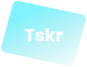

<h1 style="text-align: center; margin: 16px 0;">Tskr api</h1>

<p style="text-align: center; margin-top: 16px;">Rest api developed to demonstrate the application of SOLID principles in a tasks CRUD</p>

<br />

<h2 style="font-size: 2rem; margin-bottom: 1rem;">About the project ⚡</h2>

<p>This project was developed in order to demonstrate the creation of an api rest using the SOLID principles and some of the best technologies in the backend world. see the <a href="#techs">technologies.</a></p>

<br />

<h2 style="font-size: 2rem; margin-bottom: 1rem;"> Application Features ✨</h2>

<h2>🤗 User</h2>

<ul>
  <li>Create user</li>
  <li>Find user's data</li>
  <li>Update user</li>
  <li>Authenticate user</li>
</ul>

<h2>📃 Task</h2>

<ul>
  <li>Create task</li>
  <li>Find user's tasks</li>
  <li>Update task</li>
  <li>Delete task</li>
</ul>

<br />

<h2 style="font-size: 2rem; margin-bottom: 1rem;">Aplication Techs 💻</h2>

<ul>
  <li>Node js</li>
  <li>Typescript</li>
  <li>Express</li>
  <li>PostgreSQL</li>
  <li>Tsyringe</li>
  <li>Prisma</li>
  <li>Bcrypt</li>
  <li>Multer</li>
  <li>AWS S3</li>
  <li>JWT</li>
  <li>Uuid</li>
</ul>

<br />

# How to start the project?

<p>Clone the repository with: git clone git@github.com:henrique1758/tasker-server.git</p>

<p>Install the dependencies with the command:</p>

```sh
yarn
```
<p>To execute the server run the command:</p>

```sh
yarn dev
```
# Author 

<h3>Henrique Monteiro</h3>

<ul>
  <li>
    Linkedin: <a href="https://www.linkedin.com/in/henrique-monteiro-3a936a223/" target="_blank">@henriquemonteiro3a936a223</a>
  </li>
  <li>
    Github: <a href="https://github.com/henrique1758/" target="_blank">@henrique1758</a>
  </li>
</ul>